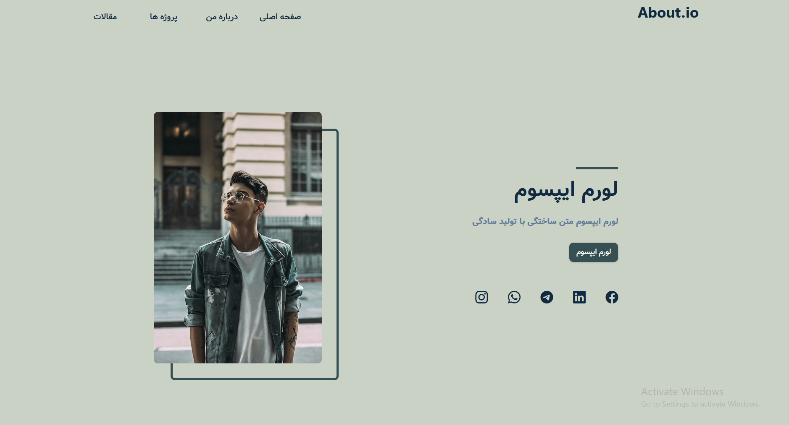
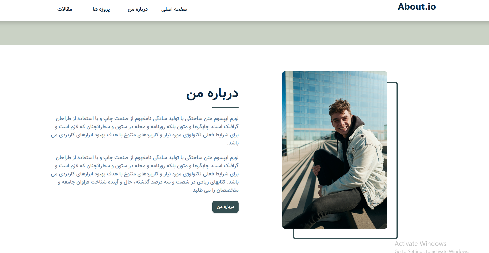
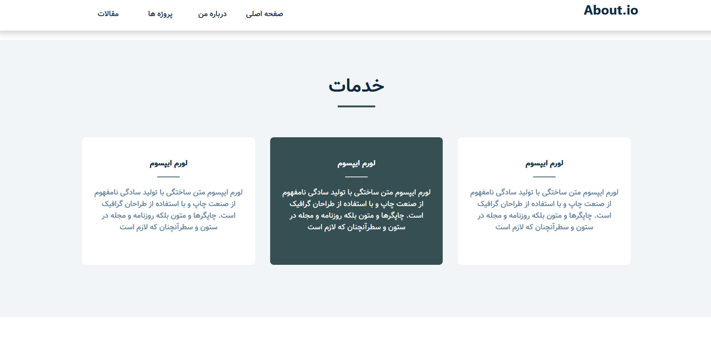
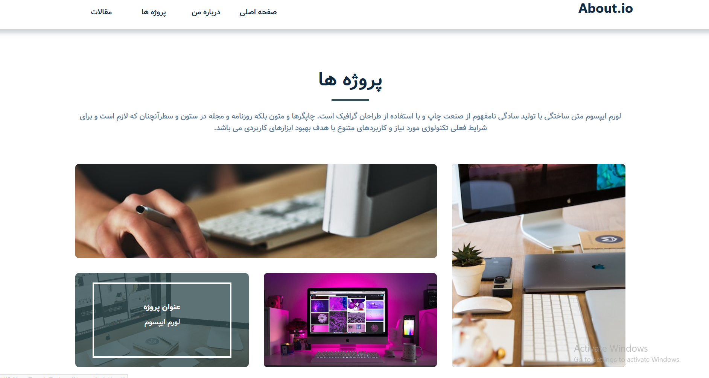
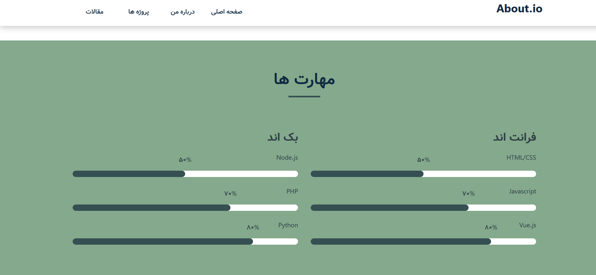
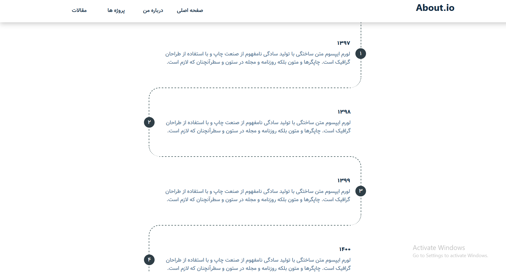

# CV-template

⚡Project for 1st November - Subject -> **CV-template**

I created this site after watching css grid course.  
The site is responsive and has many features.  ✌️

## 🔗 See Live Demo [here](https://strassntial.github.io/CV-template/) .

###  Technologies used :
>
> - Html
> - css
> - Js

### 👀 How does the website look?
#### Home 

### About

### Services

### Projects

### Contact

### Skills

### Timeline

### ✔️ To-Do's
🌝Create English format (ltr) 

### 🌌 License  
Free to use ;)